# Hibernate

### Materiale necessario
- [Hibernate jar (ultima realease)](#hibernate)
- Java 8 o superiori
- IDE (Intellij Idea o Eclipse)
- [Database server (MySQL)](#database-server)
- [JDBC driver per MySQL](#jdbc-driver)

### Classe di test
Nella cartella [TestConnection](https://github.com/parez93/GdS-Reply/tree/master/Hibernate/config/TestConnection) è possibile trovare un progetto già configurato con tutte le librerie necessarie importate in cui è presente una classe che verifica che le configurazioni siano state fatte correttamente.

### Hibernate

Scaricare dal [sito di hibernate](https://hibernate.org/orm) l'ultima release.

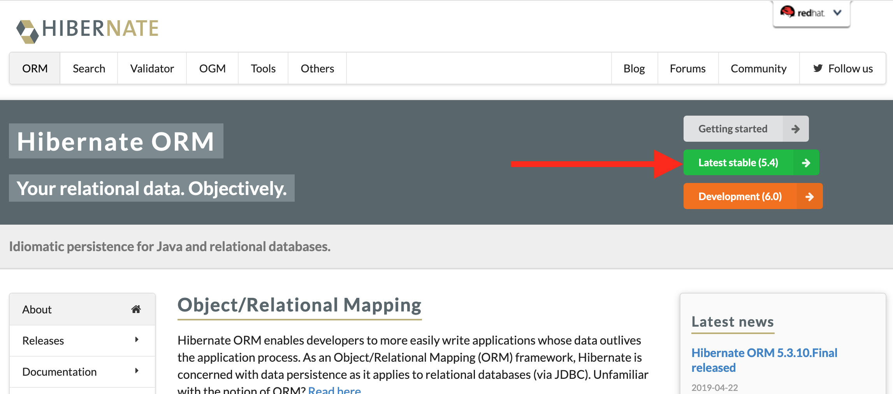
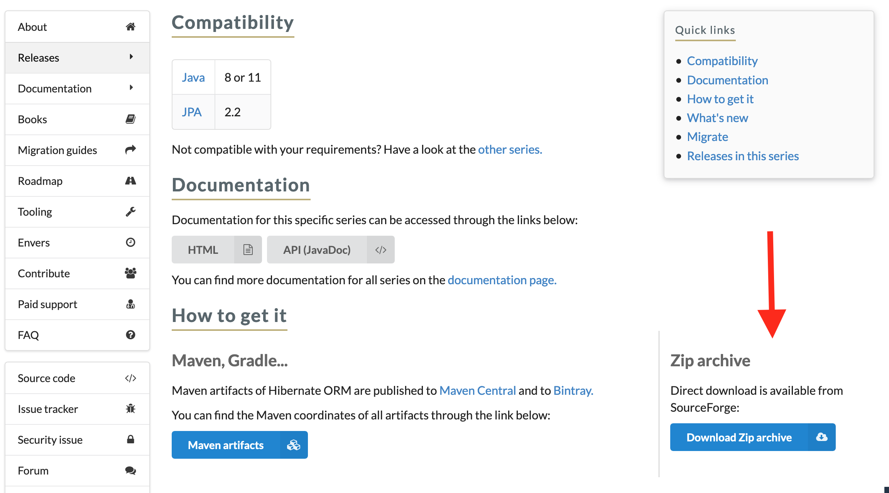

I jar da importare nel progetto java si trovano all'interno del percorso *lib/required/\*.jar*

### Database server

Scaricare dal [sito MySQL Community Server](https://dev.mysql.com/downloads/mysql).

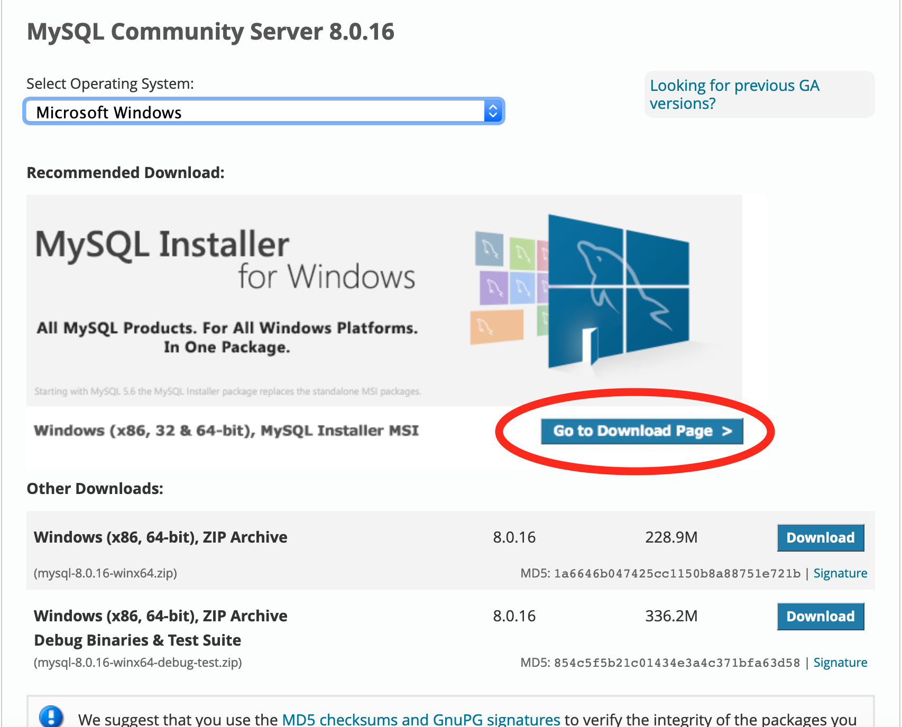

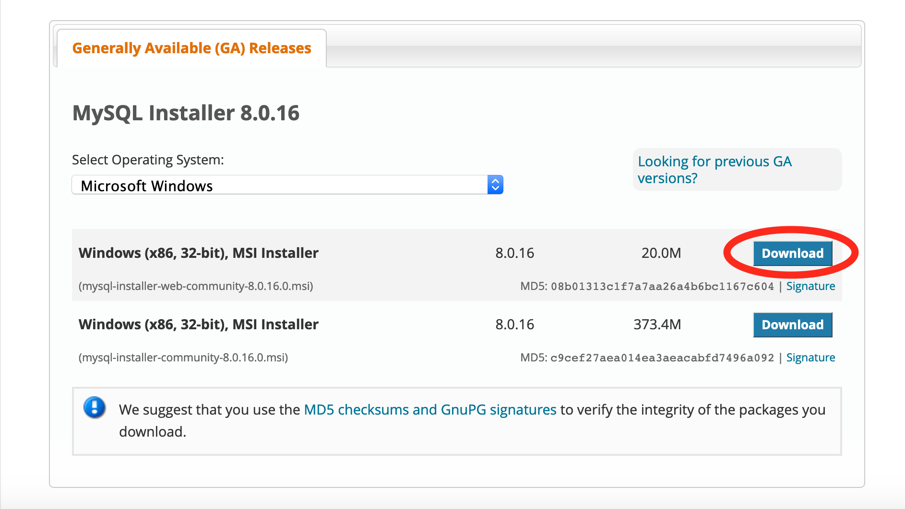

Installazione per MacOs: vedi [qui](http://dev.mysql.com/doc/refman/5.7/en/osx-installation.html).

Installazione per Windows: 
- developer default
- execute sul pacchetto mancante *MySQL Workbench*
- mantenere i valori predefiniti per *Type and networking* e *Windows service*
- root = *admin*, password = *admin*

  

    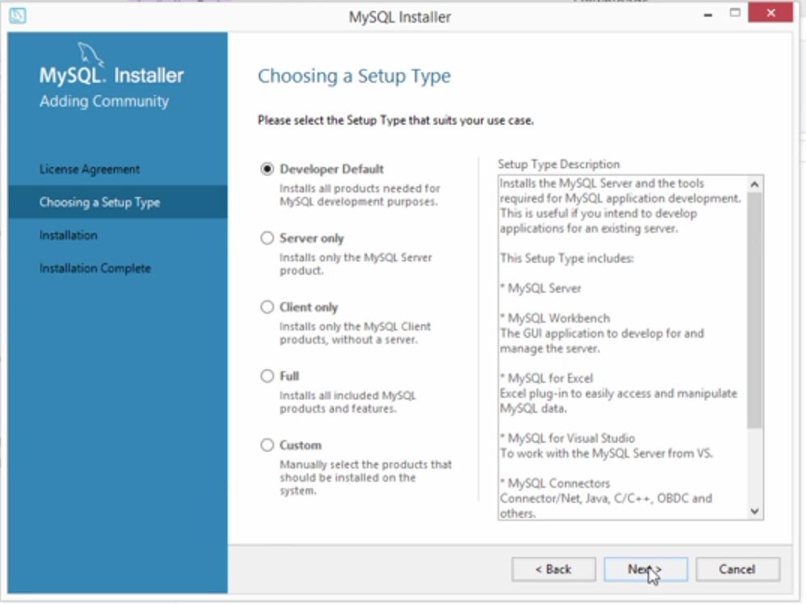
    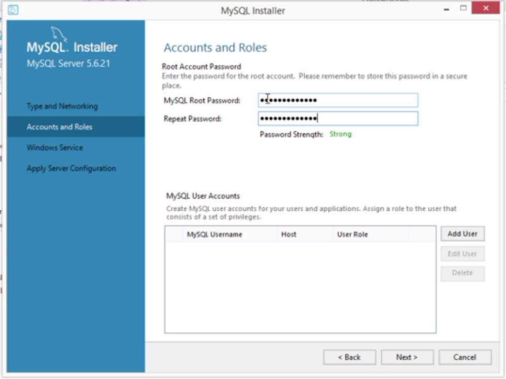
  

  

    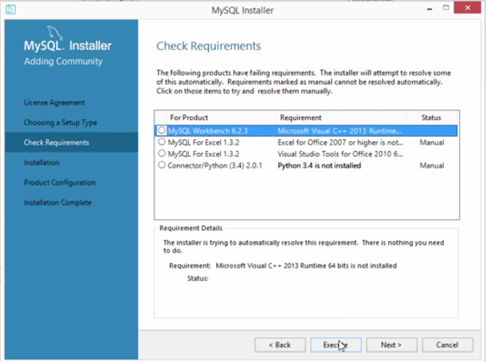
    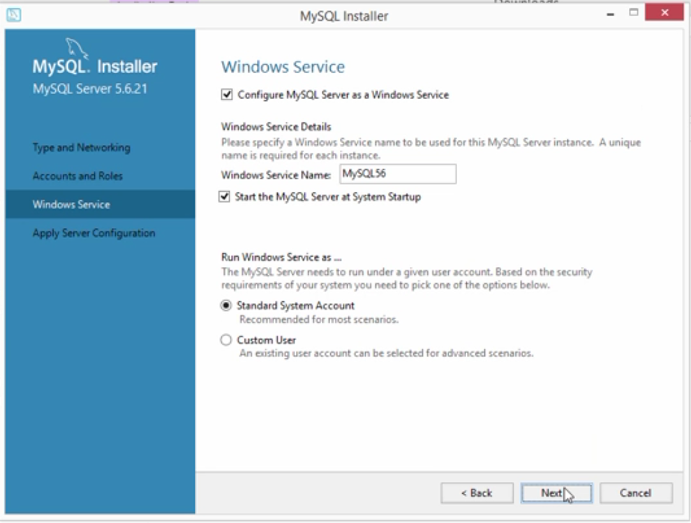
  

  

    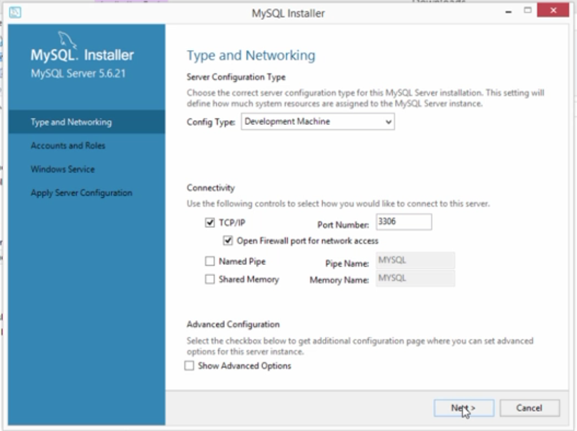
    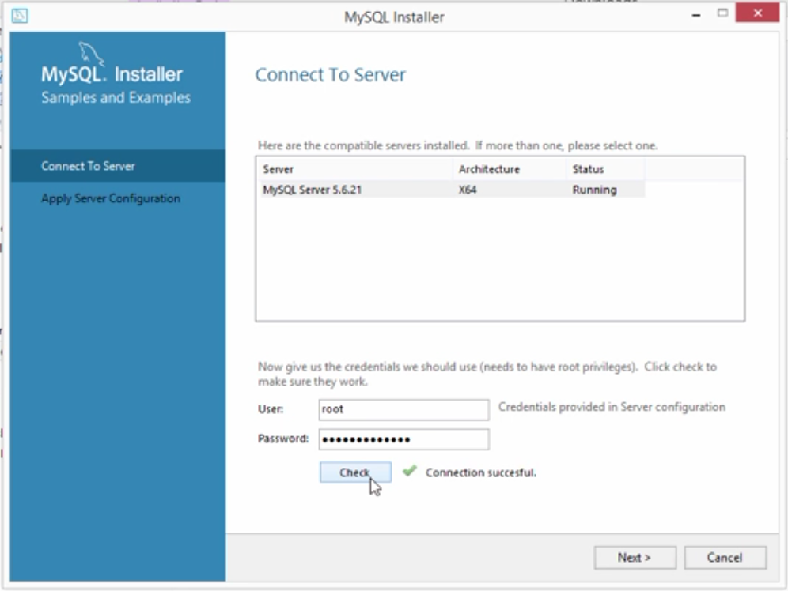
  

1. Avviare MySQLWorkbench
2. Loggarsi
3. Click sull'icona a forma di cartella
4. Selezionare script sql [*01-create-user.sql*](https://github.com/parez93/GdS-Reply/tree/master/Hibernate/config/scripts/01-create-user.sql)
5. Premere sull'icona a forma di fulmine.

Nella workbench, creare una nuova connessione ed entrare nella connessione.

1. File
2. Open SQL script
3. Selezionare script sql [*02-student-tracker.sql*](https://github.com/parez93/GdS-Reply/tree/master/Hibernate/config/scripts/02-student-tracker.sql)
4. Click sull'icona a forma di fulmine

Nella tab schemaSS fare click con il tasto destro e selezionare *refresh all* per vedere la tabella appena creata

### JDBC driver

Scaricare il driver per MySQL dal [sito](https://dev.mysql.com/downloads/connector/j).

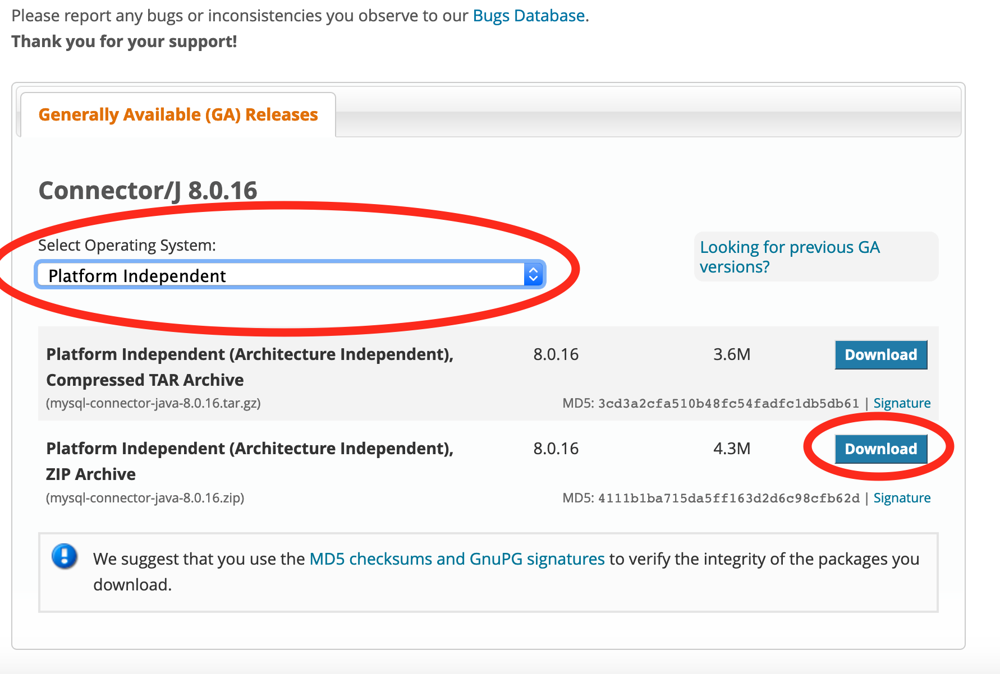
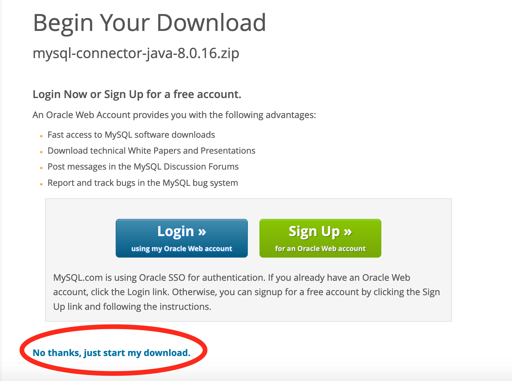

All'interno dello zip scaricato si trova il jar.
